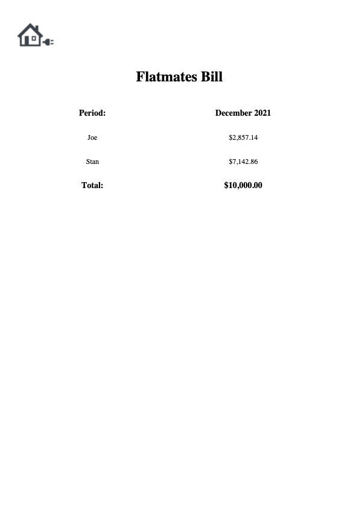

# Flatmates-Bill
 A system that generates a PDF report of the bills owed by two flatmates
 
 ## Conception
 A program that simulates a scenario of two flatmates splitting their rent bill over a period of time <br/>
 <br/>
 The Total Bill is split in proportion to the amount of days spent in the flat by each flatmate <br/>
``` python
weight = self.days / (self.days + flatmate2.days)
total = bill.amount * weight
```
Where: "self.days" = Amount of days spent in apartment by flatmate one
<br/>
<br/>

**For Instance:** <br/>
Assume a scenario in which the flatmates were splitting the bill for the period of *December 2021* <br/>
- *Total Bill*: $10,000
- *Flatmate One Days in Apartment*: 20
- *Flatmate One Days in Apartment*: 25
<br/>

``` python
weight = 20 / (20 + 25)
total_f1 = 10,000 * 0.4444
total_f1 = 4,444.44
total_f2 = 5,555.56
```
## Execution
The code would run the following way (Excluding the Safeguards):
``` python
period = input("Input a Period (Month/Year): ")
flatmate1_name = input("Input Name of Flatmate 1: ")
flatmate1_days_stayed = int(input(f"Input Days Stayed by {flatmate1_name} in Apartment: "))
flatmate2_name = input("Input Name of Flatmate 2: ")
flatmate2_days_stayed = int(input(f"Input Days Stayed by {flatmate2_name} in Apartment: "))
total_bill = float(input("Enter Total Bill: "))
```
This would output to the user as the Follwing (With Mock Answers)
'''python
Input a Period (Month/Year): December 2021
Input Name of Flatmate 1: Joe
Input Days Stayed by Joe in Apartment: 20
Input Name of Flatmate 2: Stan
Input Days Stayed by Joe in Apartment: 25
Enter Total Bill: 10,000
```


## PDF Report

